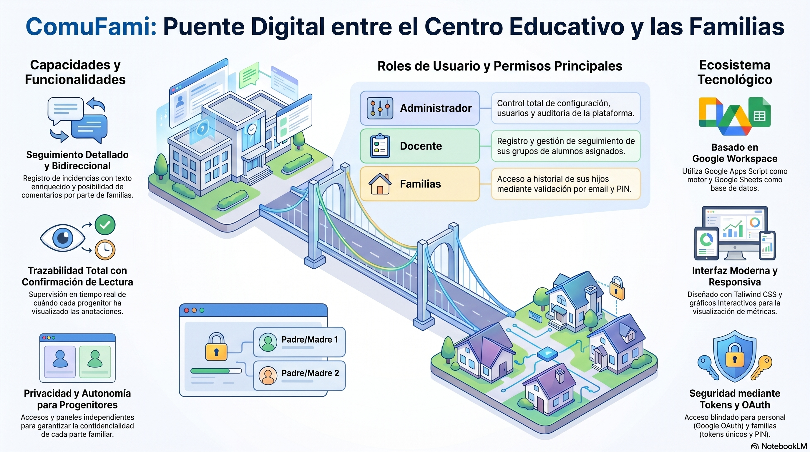
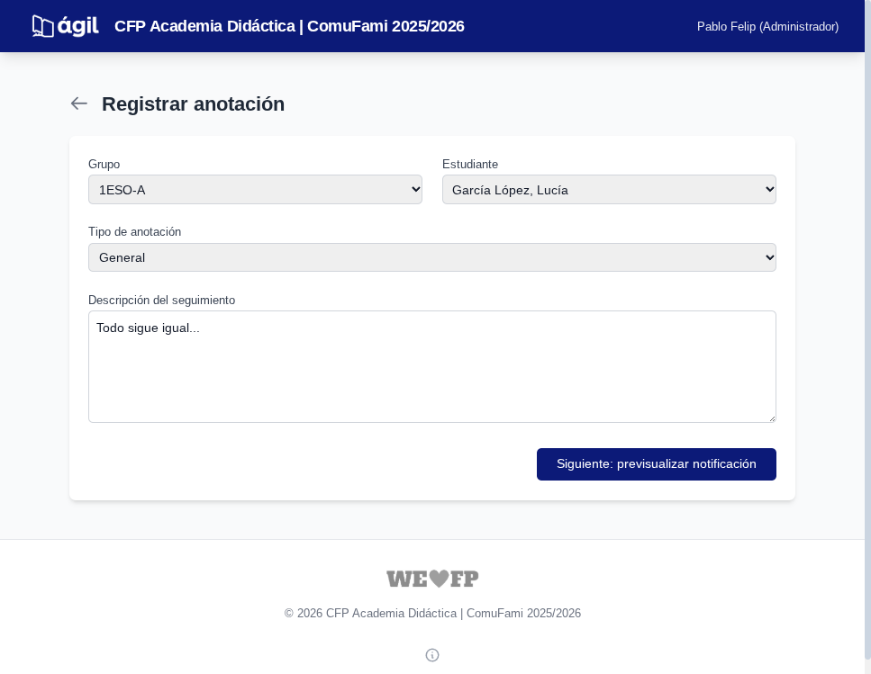
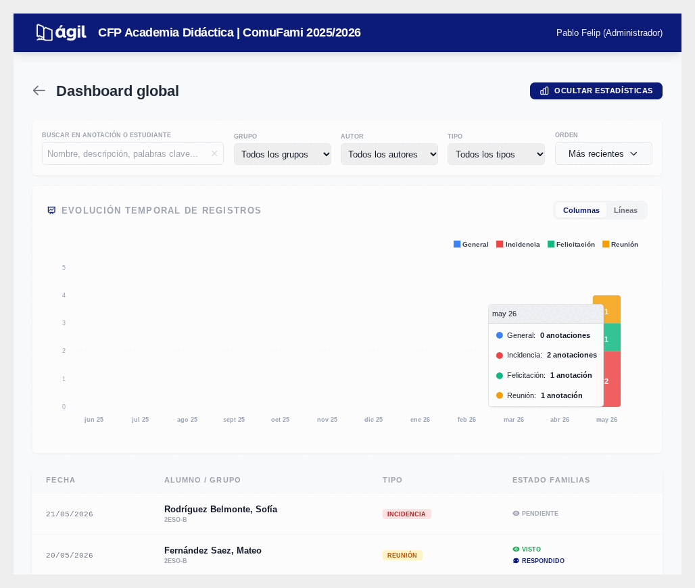
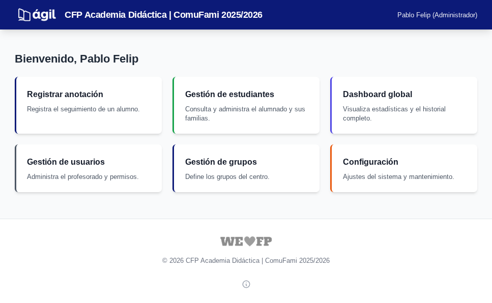
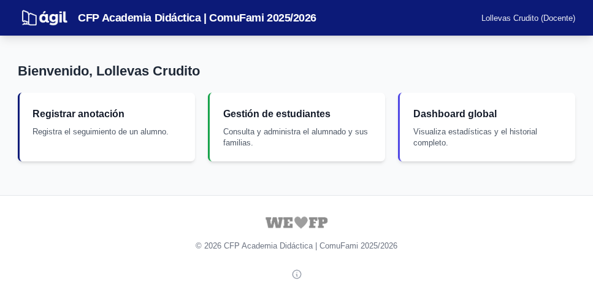
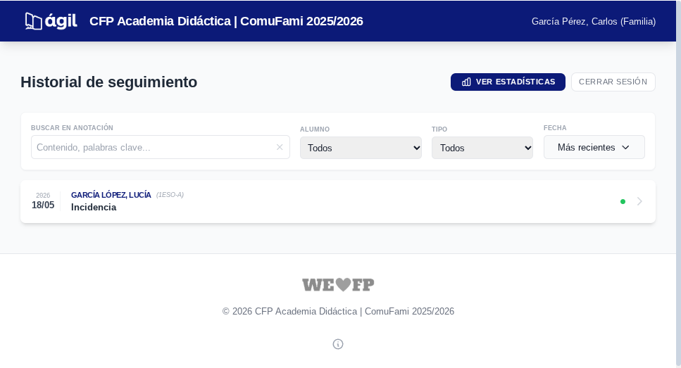
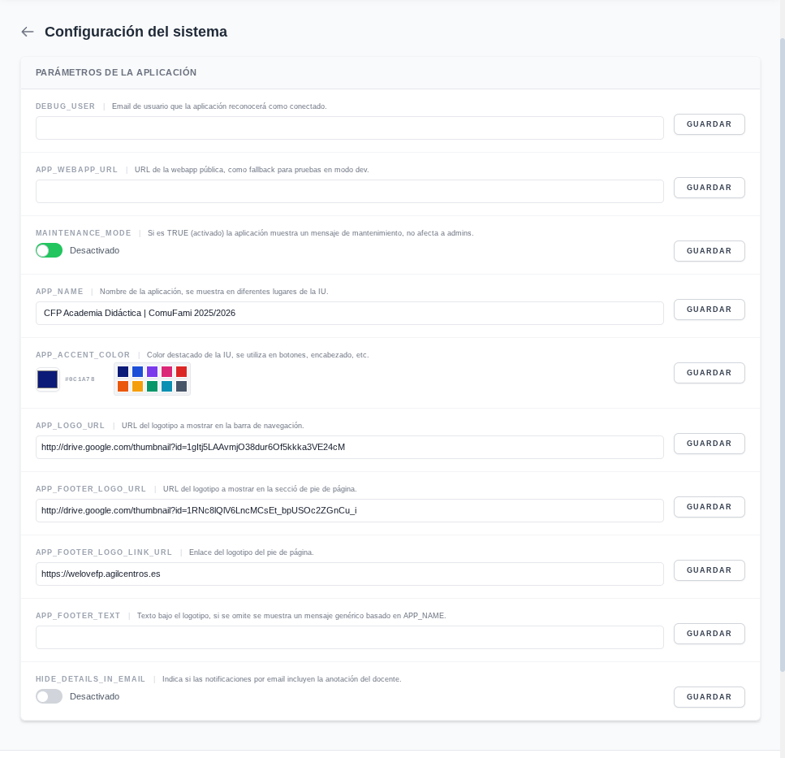
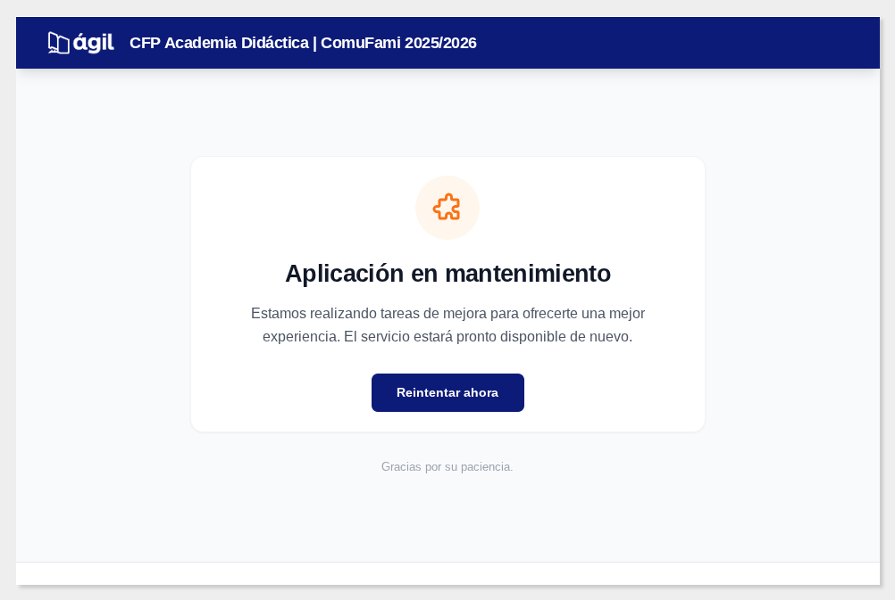
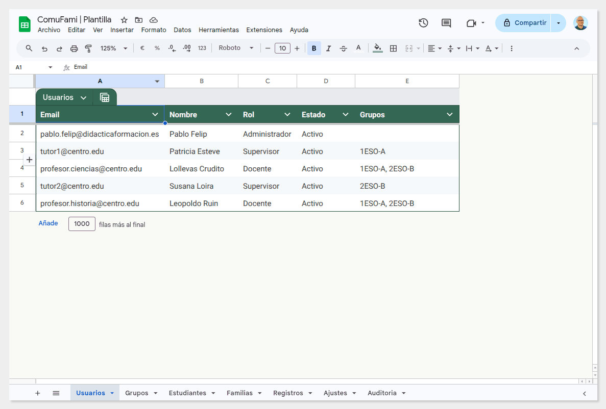

# 🏫 ComuFami: plataforma de comunicación centro-familias

**ComuFami** es una solución integral basada en Google Workspace diseñada para facilitar y agilizar la comunicación entre los centros educativos y las familias. Permite a los docentes registrar incidencias, observaciones y seguimientos de los estudiantes, asegurando que los progenitores reciban la información de manera directa y puedan interactuar con ella.

---

## 🎯 Objetivo del proyecto

El objetivo principal de ComuFami es centralizar el seguimiento del alumnado en una plataforma sencilla y accesible, eliminando las barreras de comunicación y garantizando la trazabilidad de la información compartida con las familias mediante un sistema de notificaciones y confirmaciones de lectura.

## 🚀 Funcionalidades principales

-   **Gestión de seguimiento:** registro de incidencias y observaciones con editor de texto enriquecido (Quill).
    
    
    
-   **Confirmación de lectura:** seguimiento en tiempo real de cuándo cada progenitor ha visualizado una nota.
-   **Interacción bidireccional:** las familias pueden dejar comentarios en los registros recibidos.
-   **Panel de control (dashboard):** visualización de estadísticas y métricas mediante gráficos interactivos (ApexCharts) para supervisores y administradores.
    
    
    
-   **Privacidad en notificaciones:** configuración opcional para ocultar el contenido de las anotaciones en los correos electrónicos, incentivando el acceso seguro a la plataforma para garantizar la trazabilidad.
-   **Gestión multirrol:** 
    -   **Administradores:** control total sobre la configuración, usuarios y grupos.
        
    -   **Supervisores:** visualización de registros de todos los grupos o de los asignados.
    -   **Docentes:** registro y gestión de sus grupos asignados.
        
    -   **Familias:** acceso restringido a la información exclusiva de sus hijos/as mediante validación de email y PIN. Incluye un **dashboard personalizado** para visualizar la evolución y el historial de registros de sus hijos/as, además de soporte nativo para **progenitores independientes**, con accesos, comentarios y confirmaciones de lectura totalmente separados para garantizar la privacidad y autonomía de cada parte.
        
-   **Personalización visual:** ajuste de colores corporativos, logotipos y textos de pie de página desde un panel de ajustes integrado.
    
-   **Modo mantenimiento:** capacidad de pausar el acceso a la webapp para realizar ajustes técnicos.
    
-   **Auditoría:** registro automático de todas las acciones críticas realizadas en la plataforma para garantizar la integridad de los datos.

## 🛠️ Arquitectura y tecnologías

ComuFami está construido utilizando tecnologías modernas sobre la infraestructura de Google:

-   **Backend:** [Google Apps Script](https://developers.google.com/apps-script) (V8 Runtime).
-   **Base de datos:** [Google Sheets](https://www.google.com/sheets) como base de datos relacional.
-   **Frontend:** HTML5, CSS3 y JavaScript.
    -   **Framework CSS:** [Tailwind CSS](https://tailwindcss.com/) para un diseño responsivo y moderno.
    -   **Editor de texto:** [Quill.js](https://quilljs.com/).
    -   **Gráficos:** [ApexCharts](https://apexcharts.com/).
-   **Autenticación:** Google OAuth para el personal del centro y sistema de PIN para familias.

## 📋 Estructura de datos (Google Sheets)

La hoja de cálculo que actúa como motor de datos contiene las siguientes tablas:

-   **Usuarios:** datos del personal del centro (email, nombre, rol, estado, grupos).
-   **Estudiantes:** listado de alumnos, grupos y datos de contacto de las familias.
-   **Registros:** almacén de todas las anotaciones de seguimiento, incluyendo fechas de vista y comentarios.
-   **Familias:** registro de emails de familiares, PIN de acceso y estados.
-   **Grupos:** definición de los códigos y nombres de los grupos de alumnos.
-   **Ajustes:** configuración global (colores, URLs, logos, modo mantenimiento, etc.).
-   **Auditoria:** log histórico de actividad.

## ⚙️ Configuración e instalación

> 🚧 **Nota:** La plantilla de Google Sheets necesaria para la instalación estará disponible públicamente muy pronto.

La instalación de ComuFami se realiza a partir de una plantilla de Google Sheets que ya contiene la estructura de tablas y el código de la aplicación:

1.  **Crear una copia de la plantilla:** obtén acceso a la hoja de cálculo de referencia y crea una copia en tu Google Drive.
2.  **Configurar el proyecto de script:** desde la copia de la hoja, accede a *Extensiones > Apps Script*.
3.  **Despliegue inicial:** 
    -   Haz clic en *Nuevo despliegue*.
    -   Selecciona el tipo *Aplicación web*.
    -   Configura el acceso para que sea ejecutada por el **usuario que despliega** (tú) y sea accesible para **"Cualquiera"**. Esto es fundamental para que los progenitores puedan acceder al diálogo de inicio de sesión.
4.  **Inicialización:** si la estructura no se ha creado automáticamente, puedes ejecutar la función `inicializarApp()` desde el editor de scripts.
5.  **Ajustes finales:** copia la URL de la aplicación web generada y pégala en la pestaña `Ajustes` bajo el parámetro `APP_WEBAPP_URL`.

## 🔐 Seguridad y roles

El acceso está estrictamente controlado mediante funciones de servidor que validan la identidad del usuario:

-   **Personal del centro:** accede mediante su cuenta de Google (OAuth).
-   **Familias:** acceden mediante un proceso de validación de email y PIN personal, sin necesidad de cuenta de Google específica.
-   Se utiliza un sistema de **tokens únicos** para los registros, lo que permite accesos directos seguros.
-   La **impersonación de usuario** (DEBUG_USER) está disponible para administradores para facilitar la resolución de problemas técnicos.

## 📜 Licencia

Este proyecto se distribuye bajo la licencia **GNU GPL v3**. Consulta el archivo `LICENSE` para más detalles.

---
Desarrollado con ❤️ para la comunidad educativa.
